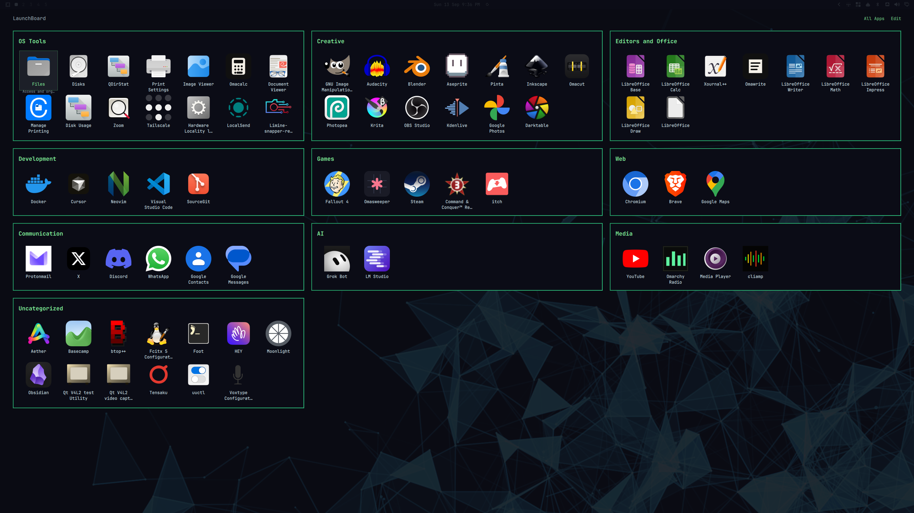

# LaunchBoard

A fullscreen, visual application library for [Omarchy](https://omarchy.org/).

The stock Omarchy launcher is great, and fast when you already know a name. But 
some of us coming from GUI land sometimes desire more of a visual experience. LaunchBoard 
is for that: installed applications as a grid of icons, grouped into **your** sections, 
with instant keyboard filtering the moment you start typing.

**Browse when you don't know what you're looking for. Type when you do.**

## Screenshot



## Features

- Fullscreen overlay that matches Omarchy's dark, restrained shell theme
- User-defined sections persisted as desktop-entry IDs
- Automatic **Uncategorized** section for anything not organized yet
- **All Apps** view of the complete library, with hidden apps in their own section
- Type-to-filter with fuzzy matching across name, generic name, comment, and keywords
- Arrow keys, Enter, Escape, and Tab — no mouse required
- Edit mode is the settings UI: create / rename / delete / reorder sections, move or hide apps, stack or tile the section cards
- App info dialog for unfamiliar `.desktop` entries
- First run works with zero configuration
- Survives Omarchy updates (no edits under `/usr/share/omarchy`)

## Installation

```bash
omarchy plugin add https://github.com/bennethon/launchboard.git --enable
```

That clones the plugin into `~/.config/omarchy/plugins/bennethon.launchboard`
and enables it. It does not change your keybindings.

Open it:

```bash
omarchy-shell shell toggle bennethon.launchboard
```

## Optional keyboard shortcut

Standard installation leaves Hyprland alone. `Super + Alt + Space` stays the
stock Apps menu. `Super + Space` (the Omarchy root menu) is unchanged.

To put LaunchBoard on `Super + Alt + Space`, opt in explicitly. Either run:

```bash
~/.config/omarchy/plugins/bennethon.launchboard/scripts/install-binding.sh
```

or add Omarchy's supported override to `~/.config/hypr/bindings.lua`:

```lua
hl.unbind("SUPER + ALT + SPACE")
o.bind("SUPER + ALT + SPACE", "LaunchBoard", "omarchy-shell shell toggle bennethon.launchboard")
```

Both are a shadow, not a replacement of Omarchy's packaged bind:

- The Apps-menu bind stays in `/usr/share/omarchy`.
- User-level `~/.config/hypr/bindings.lua` is the supported place for overrides.
- If the plugin directory is removed, the helper's `pcall` does nothing.
- `install-binding.sh --remove` deletes the helper's marker block and reloads Hyprland.
- The next reload sources only the packaged bind again.

## Removal

If you opted into the Super+Alt+Space shadow, undo that first:

```bash
~/.config/omarchy/plugins/bennethon.launchboard/scripts/install-binding.sh --remove
```

If you added the `hl.unbind` / `o.bind` lines yourself, delete those instead.

Then:

```bash
omarchy plugin remove bennethon.launchboard
```

Your layout in `~/.config/launchboard/` is kept. Delete that directory if you
want a clean slate.

## Configuration

User layout lives in:

```
~/.config/launchboard/config.json
```

Schema version 1:

```json
{
  "version": 1,
  "layout": "stack",
  "sections": [
    {
      "id": "creative",
      "name": "Creative",
      "apps": [
        "org.gimp.GIMP",
        "org.kde.krita"
      ]
    }
  ],
  "hiddenApps": []
}
```

`layout` is `"stack"` (full-width rows, the default) or `"tile"` (section
cards in two or three columns). Change it from Edit mode; it persists.

Application ids are desktop-file ids **without** the `.desktop` suffix,
matching Omarchy's AppLibrary. Both `org.gimp.GIMP` and
`org.gimp.GIMP.desktop` are accepted when the file is read.

Prefer Edit mode in the overlay over hand-editing. Missing or malformed JSON
falls back to an empty layout so the launcher stays usable.

## Keyboard

| Key | Action |
|---|---|
| Printable characters | Start or extend the search |
| `Backspace` | Edit the query |
| `Esc` | Clear query, or close LaunchBoard |
| `←` `→` `↑` `↓` | Move between apps |
| `Enter` | Launch the selected app |
| `Tab` / `Shift+Tab` | Jump between sections |
| `Ctrl+E` | Toggle Edit mode |
| `Ctrl+A` | Toggle All Apps |
| `Ctrl+N` | New section |
| `Ctrl+I` | App info |
| Right-click | Open / info / move / hide |

## Compatibility

Currently tested on Omarchy 4.0.3-1.

## Development / Local install

From a clone of this repository:

```bash
./scripts/install.sh
```

That symlinks the project into `~/.config/omarchy/plugins/bennethon.launchboard`,
enables the plugin, and writes an empty first-run config if needed. It does
not modify `~/.config/hypr/bindings.lua`. Opt in with
`./scripts/install-binding.sh` if you want Super+Alt+Space.

```bash
omarchy-shell shell rescanPlugins
omarchy-shell shell toggle bennethon.launchboard
```

Saving any file under `~/.config/omarchy/plugins/` reloads plugin QML.
`keepLoaded` is set so the overlay stays mounted between summons; a full
`omarchy restart shell` is needed after changing `keepLoaded` services, but
ordinary QML edits hot-reload.

Inspect failures:

```bash
journalctl --user -u omarchy-shell -n 80 --no-pager
# or the session log your install uses
omarchy-shell shell ping
```

Local removal:

```bash
./scripts/uninstall.sh            # plugin; Super+Alt+Space shadow if you opted in
./scripts/uninstall.sh --purge    # also delete ~/.config/launchboard
./scripts/uninstall.sh --keep-bind
```

Do not edit `/usr/share/omarchy`. See
[`docs/omarchy-integration.md`](docs/omarchy-integration.md) for the APIs
LaunchBoard relies on and the fallbacks it uses.

## Project structure

```
launchboard/
├── manifest.json              # Omarchy plugin contract
├── preview.png                # Marketplace listing image
├── qml/
│   ├── Launcher.qml           # Overlay entry point
│   ├── AppGrid.qml
│   ├── AppCard.qml
│   ├── Section.qml
│   ├── SearchController.qml
│   ├── AppSource.qml          # AppLibrary or DesktopEntries
│   ├── ConfigStore.qml
│   ├── AppSearch.js
│   ├── Config.js
│   └── Layout.js
├── scripts/
│   ├── install.sh             # Local symlink install; no keybinding changes
│   ├── install-binding.sh     # Optional Super+Alt+Space shadow
│   └── uninstall.sh
├── hypr/bindings.lua          # Optional Super+Alt+Space snippet
├── docs/screenshot.png
├── docs/omarchy-integration.md
└── README.md
```

## Known limitations

- On Omarchy 4.0.3 the host injects a scoped `shell` facade but not
  `appLibrary`, even when `menu` is declared. LaunchBoard uses Quickshell
  `DesktopEntries` and `uwsm-app -- gtk-launch` instead.
- The LaunchBoard layer namespace is not in Omarchy's stock no-animation
  rule. The optional binding helper adds a user-level `layer_rule`.

## License

MIT. See [LICENSE](LICENSE).
